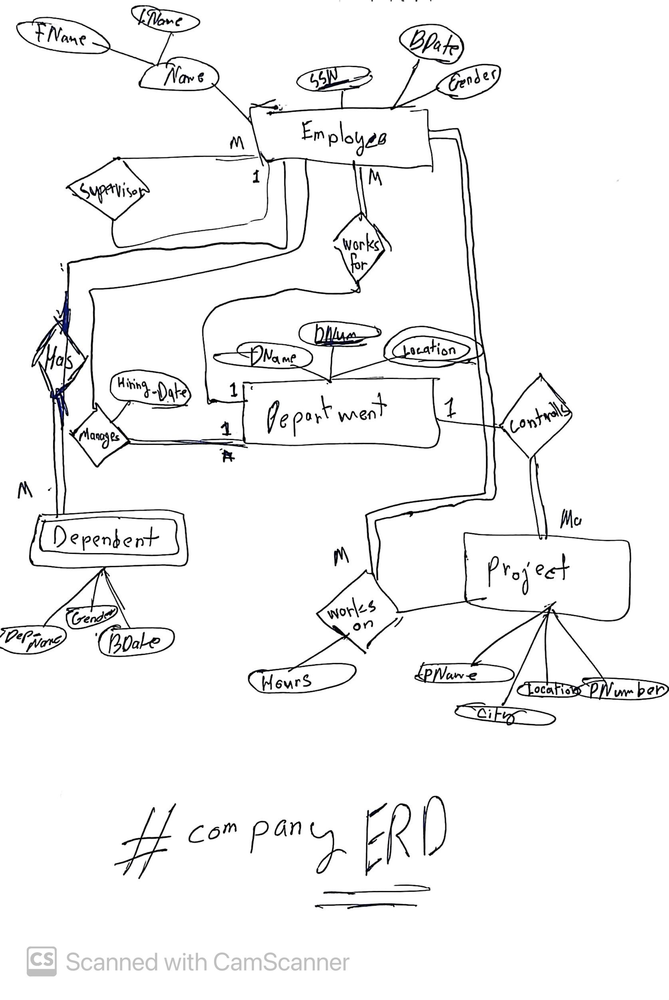
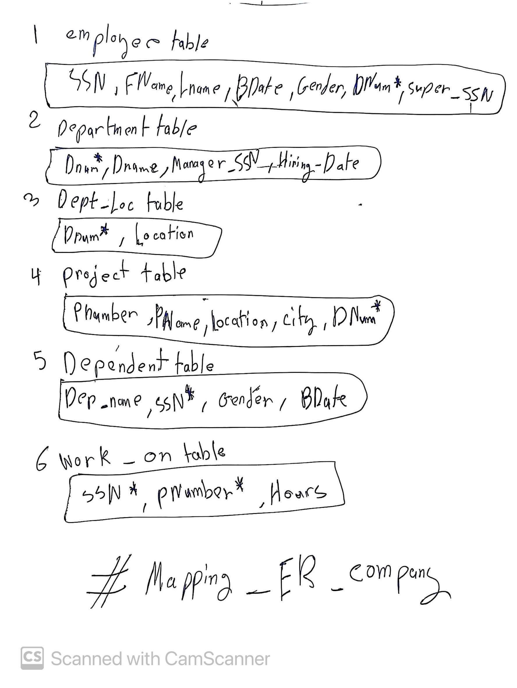
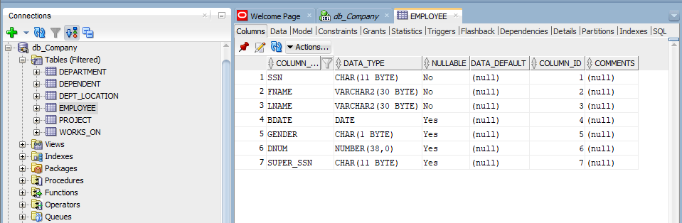
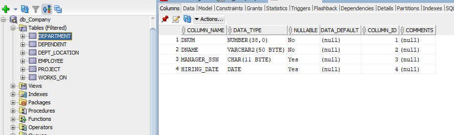
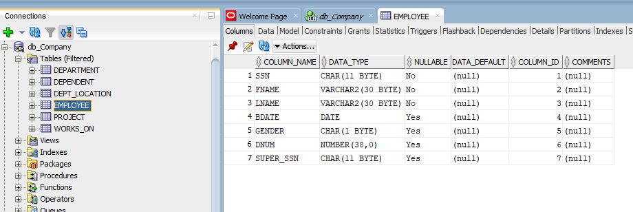
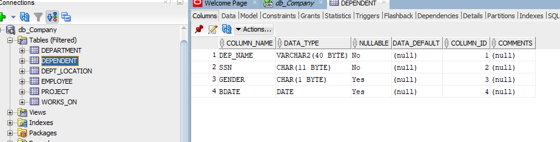
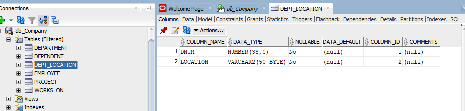
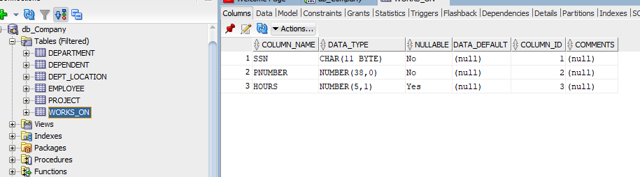

# sqlOracleDatabaseDaigrams

A structured Oracle SQL project demonstrating the full database design lifecycle: hand-drawn ERD → relational mapping → DDL/DML/DQL implementation in Oracle SQL Developer.

---

## Workflow

```
1. Draw ERD  →  2. Map to Relations  →  3. Write DDL (CREATE/ALTER)  →  4. Write DML (INSERT)  →  5. Write DQL (SELECT)
```

---

## Repository Structure

```
sqlOracleDatabaseDaigrams/
├── Entity_Daiagrams_draws/
│   └── Company_Er_Diagram_1.JPG       # Hand-drawn ER diagram
├── Mapping_Erd/
│   └── Mapping_Er_Diagram_1.JPG       # Relational mapping diagram
└── Submession/
    └── CompanyERD/
        ├── db_Company.sql             # Full DDL script (CREATE + ALTER TABLE)
        ├── DMLcommands.txt            # INSERT statements for all tables
        ├── DQLselectqueries.txt       # 10 example SELECT queries
        └── Structure/                 # SQL Developer table screenshots
            ├── EMPLOYEE.png
            ├── DEPARTMENT.png
            ├── PROJECT.png
            ├── DEPENDENT.png
            ├── DEP_LOCATION.png
            └── WORKS_ON.png
```

---

## Database Schema — Company ERD

### Tables

| Table | Primary Key | Foreign Keys |
|---|---|---|
| `EMPLOYEE` | `SSN` | `DNUM` → DEPARTMENT, `Super_SSN` → EMPLOYEE |
| `DEPARTMENT` | `DNUM` | `Manager_SSN` → EMPLOYEE |
| `PROJECT` | `PNumber` | `DNUM` → DEPARTMENT |
| `DEPENDENT` | `(Dep_Name, SSN)` | `SSN` → EMPLOYEE (CASCADE DELETE) |
| `DEPT_LOCATION` | `(DNUM, Location)` | `DNUM` → DEPARTMENT |
| `WORKS_ON` | `(SSN, PNumber)` | `SSN` → EMPLOYEE, `PNumber` → PROJECT |

### Relationships

| Relationship | Type | Tables Involved |
|---|---|---|
| Works_For | 1:N | DEPARTMENT → EMPLOYEE |
| Manages | 1:1 | DEPARTMENT ↔ EMPLOYEE |
| Controls | 1:N | DEPARTMENT → PROJECT |
| Supervises | Unary 1:N | EMPLOYEE → EMPLOYEE |
| Works_On | M:N | EMPLOYEE ↔ PROJECT (via WORKS_ON) |
| Has | 1:M weak entity | EMPLOYEE → DEPENDENT |
| Has_Location | 1:M multivalued | DEPARTMENT → DEPT_LOCATION |

---

## ERD Diagram



---

## Relational Mapping



---

## SQL Developer — Table Structures

| EMPLOYEE | DEPARTMENT | PROJECT |
|---|---|---|
|  |  |  |

| DEPENDENT | DEPT_LOCATION | WORKS_ON |
|---|---|---|
|  |  |  |

---

## How to Run in Oracle SQL Developer

1. Open Oracle SQL Developer and connect to your schema.
2. Run `Submession/CompanyERD/db_Company.sql` — creates all tables and adds FK constraints.
3. Run the INSERT statements from `DMLcommands.txt` in order (Departments → Employees → Projects → Locations → Dependents → Works_On).
4. Test queries from `DQLselectqueries.txt`.

> The DDL script is split into two phases: Phase 1 creates tables without FK constraints, Phase 2 adds them via `ALTER TABLE`. This avoids circular dependency errors during table creation.

---

## Sample Data

| Entity | Records |
|---|---|
| Departments | 3 (Engineering, Information Technology, Human Resources) |
| Employees | 8 |
| Projects | 4 (Muscat Smart Grid, Marmul Oil Expansion, HR Digital Portal, Network Infrastructure) |
| Dependents | 6 |
| Dept Locations | 5 (Muscat, Sohar, Salalah) |
| Works_On assignments | 12 |
